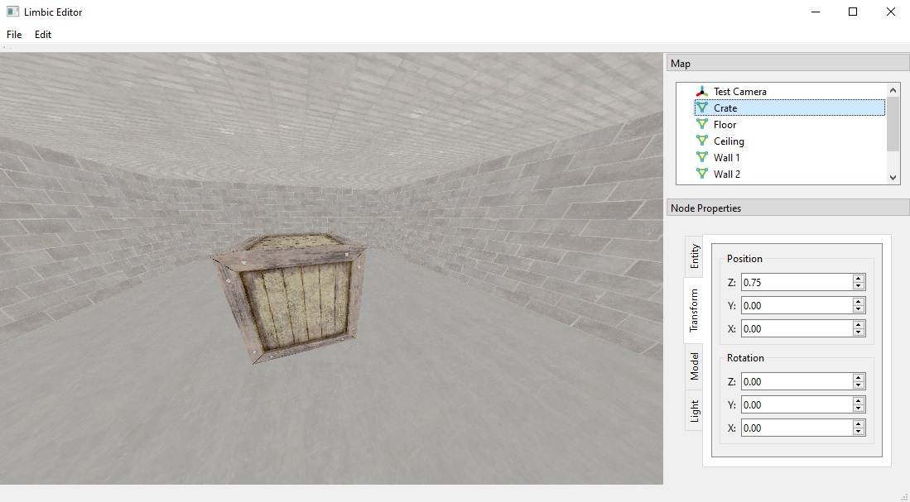

# Limbic Engine
A custom lightweight 3D VR game engine.

## Building
Limbic Engine is written in Visual Studio for Windows x64, and supports x64 Release and Debug
builds.

To generate the Visual Studio solution with cmake:

    mkdir build
    cd build
    cmake -G"Visual Studio 17 2022" -A x64 ..

## Dependencies
Binaries and header files for most dependencies are in `ThirdParty/`. 

For larger libraries such as Vulkan, OpenXR, Qt6, and FBX, follow the instructions in `ThirdParty/README.md`
to install them from their respective repositories or installers.